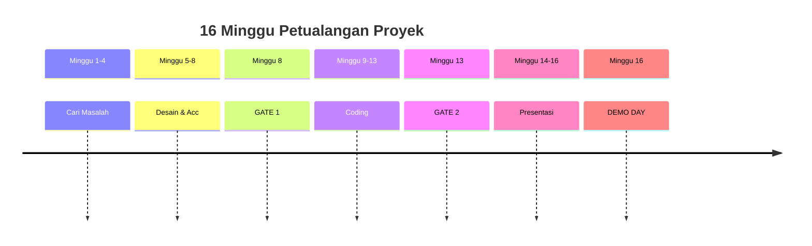
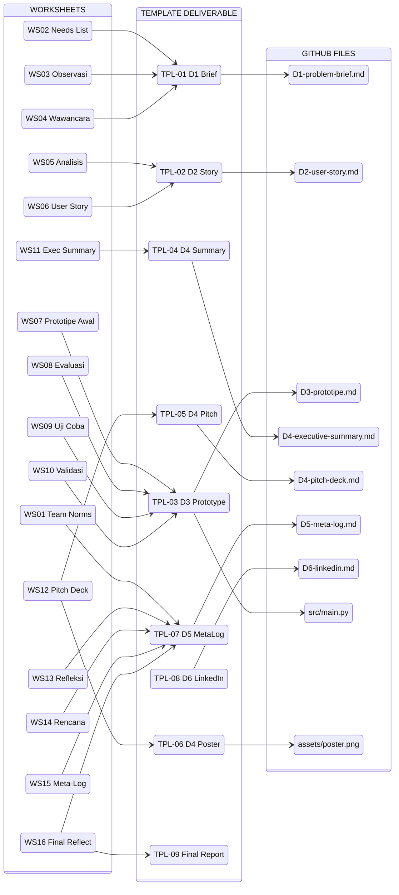

# Buku Petunjuk Project-Based Learning (PBL) - Level 1

**Digital Problem Framing Mini Project**

| Komponen            | Nilai                                                                                                            |
| ------------------- | ---------------------------------------------------------------------------------------------------------------- |
| Program Studi       | Sistem Informasi                                                                                                 |
| Semester            | 1 (Foundation Entry)                                                                                             |
| Tahun Akademik      | 2026/2027                                                                                                        |
| Versi               | 2.0                                                                                                              |
| Terakhir Diperbarui | 2026-09-11                                                                                                       |
| Catatan Revisi      | tambahkan LinkedIn (D6); GitHub untuk manajemen proyek; section Template terpusat; tambah referensi Starter Pack |

## Peta Petualangan (Student Journey Map)



### Detail per Fase

| Fase | Minggu | Worksheet | Deliverable | Milestone |
|---|---|---|---|---|
| **Cari Masalah** | 1-4 | WS01 Team Formation | D1 Problem Brief (draft) | - |
| | | WS02 Needs List | | |
| | | WS03 Observasi Lapangan | | |
| | | WS04 Wawancara Pemilik Usaha | | |
| **Desain & Acc** | 5-8 | WS05 Analisis Masalah | D1 Problem Brief (final) | - |
| | | WS06 User Story | D2 User Story (final) | |
| | | WS07 Prototipe Awal | | |
| | | WS08 Evaluasi Rekan | | |
| **GATE 1** | 8 | - | D1 + D2 final | Cek kelengkapan |
| **Coding** | 9-13 | WS09 Uji Coba Pengguna | D3 Prototipe (final) | - |
| | | WS10 Validasi Klien | | |
| **GATE 2** | 13 | - | D3 selesai + Klien validasi | Cek kode |
| **Presentasi** | 14-16 | WS11 Executive Summary | D4 Executive Summary | - |
| | | WS12 Pitch Deck | D4 Pitch Deck | |
| | | WS13 Refleksi Tim | D5 Meta-Log (final) | |
| | | WS14 Rencana Lanjut | D6 LinkedIn | |
| | | WS15 Isi Meta-Log | | |
| | | WS16 Final Reflection | | |
| **DEMO DAY** | 16 | - | Presentasi + Poster | Akhir proyek |

## Daftar Isi

1. [Misi Kalian (The Mission)](#bab-1-misi-kalian-the-mission)
2. [Aturan Main & Etika](#bab-2-aturan-main--etika)
3. [GitHub: Rumah Proyek Kalian](#bab-3-github-rumah-proyek-kalian)
4. [Pos-Pos Checkpoint (Milestones)](#bab-4-pos-pos-checkpoint-milestones)
5. [Panduan Deliverable (The Artifacts)](#bab-5-panduan-deliverable-the-artifacts)
6. [Kotak P3K Proyek (Troubleshooting)](#bab-6-kotak-p3k-proyek-troubleshooting)
7. [Pusat Template](#pusat-template)
8. [Lampiran](#lampiran)

## Kamus Saku Mahasiswa

| Istilah | Artinya apa? | Analogi Sederhana |
|---|---|---|
| **Driving Question** | Pertanyaan utama yang memandu seluruh proyek | Seperti GPS - semua langkah mengarah ke sini |
| **Deliverable** | Hasil kerja yang harus kalian serahkan | Seperti "PR- di akhir bab |
| **Gate Review** | Titik cek point proyek diperiksa | Seperti ujian SIM - lulus sebelum lanjut |
| **Demo Day** | Hari presentasi produk akhir | Seperti "open house" - karya dipamerkan ke orang luar |
| **Critique** | Sesi umpan balik antartim | Seperti "review film" - kasih pendapat yang membangun |
| **Oral Defense** | Presentasi lisan mempertahankan hasil kerja | Seperti sidang skripsi versi mini |
| **Walkthrough** | Penjelasan kode baris demi baris | Seperti "tur rumah" - tunjukkan bagian demi bagian |
| **User Story** | Kebutuhan dari sudut pandang pengguna | "Sebagai [peran], saya ingin [fitur] supaya [manfaat]" |
| **Acceptance Criteria** | Kriteria yang bisa diukur untuk kebutuhan | Seperti "checklist" - centang jika sesuai |
| **AI Disclosure** | Catatan transparan tentang penggunaan AI | Seperti "daftar bahan- pada resep |
| **Project Meta-Log** | Gabungan catatan AI + keputusan penting | Seperti "buku harian proyek" |
| **SFIA** | Kerangka kompetensi TI internasional | Seperti "level RPG" - menunjukkan keahlian |
| **LinkedIn** | Profil profesional online | Seperti "kartu nama digital" |
| **Repository (Repo)** | Tempat menyimpan kode di GitHub | Seperti "lemari arsip" digital untuk proyek |
| **Commit** | Menyimpan perubahan kode ke repo | Seperti "save" tapi dengan catatan perubahan |
| **Pull Request (PR)** | Meminta approval sebelum gabung kode | Seperti "menyerahkan tugas" untuk diperiksa dosen |

<div style="page-break-before: always;"></div>

# Bab 1: Misi Kalian (The Mission)

## Apa Proyek Ini?

Proyek **Digital Problem Framing Mini Project** adalah kesempatan kalian untuk:

1. **Mengunjungi** unit usaha nyata (kantin, warung, koperasi) di sekitar kampus
2. **Memahami** masalah yang mereka hadapi
3. **Merancang** solusi sederhana berbasis program
4. **Membangun** prototipe program konsol (CLI)
5. **Mempresentasikan** hasil ke pemilik usaha
6. **Membangun portofolio digital** pertama kalian di LinkedIn

> **Misi Utama**: "Bagaimana kita memahami masalah nyata sebuah unit usaha kecil, merumuskannya dengan jelas, lalu membangun program sederhana yang benar-benar membantu?"

## Apa yang Kalian Latih?

| Peran | Yang Kalian Pelajari | Template Terkait |
|---|---|---|
| **Analis Bisnis Pemula** | Mengidentifikasi masalah & menulis kebutuhan | TPL-01, TPL-02 |
| **Programmer Pemula** | Membuat program sederhana untuk masalah nyata | TPL-03 |
| **Komunikator Profesional** | Menyampaikan ide secara jelas (lisan & tulisan) | TPL-04, TPL-05 |
| **Tim Kolaboratif** | Bekerja sama, menyelesaikan konflik, memberi umpan balik | TPL-06, TPL-07 |
| **Profesional Digital** | Membangun jejak digital karier (LinkedIn) | TPL-08 |

## Batasan Proyek

| Boleh | Tidak Boleh |
|---|---|
| Program konsol/CLI (teks di terminal) | Database yang dibuat sendiri |
| Input dari keyboard, output ke layar | Integrasi dengan sistem lain |
| Simpan data di file `.txt` atau `.csv` | Pengembangan web atau aplikasi mobile |
| Python Standard Library | Library eksternal (lihat Lampiran A) |

> **Tenang, kalian tidak diharapkan jago coding sejak hari pertama.** Proyek ini dirancang untuk belajar sambil jalan. Tugas kalian adalah belajar menerapkannya, bukan sudah menguasainya di awal.

###  Langkah Pertama Kamu (Minggu 1)

- [ ] Kenalan dengan anggota tim lainnya
- [ ] Isi WS01 (pembentukan tim & norma)
- [ ] **Clone Starter Pack** (lihat "Starter Pack- di bawah)
- [ ] Buat repository GitHub kalian (lihat Bab 3)
- [ ] Tentukan peran sementara (bisa berubah nanti)
- [ ] Buat grup chat (WhatsApp/Telegram) untuk tim
- [ ] Baca Driving Question di halaman 1 buku ini

### Starter Pack

Untuk mempercepat awal proyek, tersedia **starter pack** yang bisa langsung kalian clone. Starter pack berisi:

- `README.md` - deskripsi proyek & struktur repository
- `docs/D1-problem-brief.md` s.d. `docs/D6-linkedin.md` - template deliverable
- `src/main.py` - kode awal program CLI (siap dijalankan)
- `src/test_log.md` - log hasil uji
- `.gitignore` - file yang diabaikan Git

```bash
# Clone starter pack dari instructor
git clone [URL_STARTER_PACK] pbl-level1-[nama-tim]
cd pbl-level1-[nama-tim]
python src/main.py   # coba jalankan program awal
```

> **Catatan**: Starter pack hanyalah template. Kalian wajib mengubah isi README, kode program, dan deliverable sesuai masalah yang kalian temukan di lapangan.

<div style="page-break-before: always;"></div>

# Bab 2: Aturan Main & Etika

## Pembagian Peran Tim

| Peran | Tugas Utama | Template Terkait |
|---|---|---|
| **Koordinator Tim** | Atur jadwal, fasilitasi rapat, koordinasi | TPL-06 |
| **Analis** | Kerjakan D1 (Problem Brief) & D2 (User Story) | TPL-01, TPL-02 |
| **Pengembang** | Kerjakan D3 (Prototipe Program) | TPL-03 |
| **Dokumentator/Presenter** | Kerjakan D4 (Executive Summary) & log keputusan | TPL-04, TPL-05, TPL-07 |

## Aturan Kerja Tim

1. **Tidak ada free-rider** - kontribusi dicatat di TPL-07 (Project Meta-Log)
2. **Kehadiran wajib** di Gate 1, Gate 2, dan Demo Day
3. **Jika ada konflik**, bicarakan dulu di tim. Jika tidak terselesaikan, minta bantuan dosen

## Kebijakan AI

| Boleh | Tidak Boleh |
|---|---|
| AI sebagai "asisten- untuk brainstorming | Submit hasil AI mentah tanpa perubahan |
| AI untuk membantu grammar bahasa Inggris | AI mengerjakan seluruh deliverable |
| AI untuk saran kode | AI menggantikan wawancara pemilik usaha |

**Wajib**: Catat penggunaan AI di TPL-07 (Project Meta-Log) +' bagian *AI Usage Disclosure*.

<div style="page-break-before: always;"></div>

# Bab 3: GitHub - Rumah Proyek Kalian

Seluruh manajemen proyek dan dokumentasi dilakukan menggunakan **GitHub**. Ini bukan hanya tempat menyimpan kode, tapi juga tempat kalian berkolaborasi, melacak perubahan, dan membangun portofolio.

## Kenapa GitHub?

| Manfaat | Penjelasan |
|---|---|
| **Versi kode selalu aman** | Kode tersimpan online, tidak hilang jika laptop rusak |
| **Riwayat perubahan** | Setiap perubahan terekam - siapa yang mengubah apa, kapan |
| **Kolaborasi tim** | Bisa kerja bareng tanpa takut file saling timpa |
| **Portofolio** | Rekruter bisa melihat aktivitas GitHub kalian |
| **Standar industri** | Hampir semua perusahaan tech pakai GitHub |

## Setup Repository (Minggu 1)

### Opsi Cepat: Clone Starter Pack

Jika instructor menyediakan starter pack, langkah paling cepat adalah:

```bash
git clone [URL_STARTER_PACK] pbl-level1-[nama-tim]
cd pbl-level1-[nama-tim]
```

Starter pack sudah memiliki struktur folder dan template deliverable yang siap pakai. Lanjut ke **Langkah 3**.

### Opsi Manual: Buat Repository Sendiri

### Langkah 1: Buat Repository

1. Buka [github.com](https://github.com) +' login (buat akun jika belum punya)
2. Klik **"+"** di pojok kanan atas +' **"New repository"**
3. Isi:
   - **Repository name**: `pbl-level1-[nama-tim]` (contoh: `pbl-level1-tim-alpha`)
   - **Description**: `Digital Problem Framing Mini Project - [Nama Kantin/Warung]`
   - **Visibility**: **Private** (atau Public sesuai instruksi dosen)
   - Centang **"Add a README file"**
   - **.gitignore**: pilih **Python**
4. Klik **"Create repository"**

### Langkah 2: Struktur Folder

Buat struktur folder berikut di repository:

```
pbl-level1-[nama-tim]/
├── README.md                    # Deskripsi proyek
├── docs/                        # Dokumen proyek
│   ├── D1-problem-brief.md      # TPL-01
│   ├── D2-user-story.md         # TPL-02
│   ├── D3-prototipe.md          # TPL-03
│   ├── D4-executive-summary.md  # TPL-04
│   ├── D4-pitch-deck.md         # TPL-05
│   ├── D5-meta-log.md           # TPL-07
│   └── D6-linkedin.md           # TPL-08
├── src/                         # Kode program
│   ├── main.py
│   ├── README.md                # Penjelasan kode
│   └── test_log.md              # Log hasil uji
├── assets/                      # Gambar, screenshot, dll
│   ├── flowchart.png
│   └── demo-screenshot.png
└── worksheets/                  # Worksheet (opsional)
    ├── WS01-team-norms.md
    └── ...
```

### Langkah 3: Clone ke Laptop

```bash
# Install Git jika belum ada: https://git-scm.com/
git clone https://github.com/[username]/pbl-level1-[nama-tim].git
cd pbl-level1-[nama-tim]
```

## Cara Kerja di GitHub (Cheat Sheet)

| Aktivitas | Command | Kapan Dipakai |
|---|---|---|
| **Clone** (unduh repo ke laptop) | `git clone [url-repo]` | Pertama kali setup |
| **Add** (tandai file baru/diubah) | `git add .` | Setelah mengubah file |
| **Commit** (simpan perubahan) | `git commit -m "pesan: tambah D1"` | Setelah selesai mengerjakan sesuatu |
| **Push** (kirim ke GitHub online) | `git push origin main` | Setelah commit, supaya tim lain lihat |
| **Pull** (ambil update dari tim) | `git pull origin main` | Sebelum mulai kerja, pastikan sudah update |
| **Branch** (cabang kerja terpisah) | `git checkout -b fitur-baru` | Saat ingin coba sesuatu tanpa ganggu main |
| **Merge** (gabung cabang ke main) | `git merge fitur-baru` | Setelah fitur selesai dan diuji |

### Template Commit Message

Gunakan format yang konsisten agar mudah dilacak:

```
[tipe]: [deskripsi singkat]

Contoh:
[D1]: tambah problem brief kantin makmur
[D2]: update user story setelah validasi pemilik
[D3]: tambah kode program fitur input penjualan
[D4]: finalisasi executive summary bahasa Inggris
[fix]: perbaiki error input angka negatif
[docs]: update README dengan deskripsi proyek
```

## Aturan GitHub untuk Tim

1. **Jangan langsung push ke `main`** - buat branch dulu, lalu buka Pull Request (PR)
2. **Setiap push wajib ada commit message** yang jelas
3. **Review kode tim lain** sebelum merge ke `main`
4. **README.md wajib diupdate** setiap ada perubahan besar
5. **Screenshot demo** disimpan di folder `assets/`

## README.md Template

```markdown
# [Nama Tim] - Digital Problem Framing Mini Project

## Tim
- [Nama 1] - Koordinator Tim
- [Nama 2] - Analis
- [Nama 3] - Pengembang
- [Nama 4] - Dokumentator/Presenter

## Objek Studi
[Nama unit usaha] " [lokasi]

## Masalah Utama
[1 kalimat masalah]

## Solusi
[1 kalimat solusi]

## Struktur Repository
- `docs/` +' Dokumen deliverable (D1"D6)
- `src/` +' Kode program
- `assets/` +' Gambar & screenshot

## Cara Menjalankan
```bash
python src/main.py
```

## AI Disclosure
Seluruh penggunaan AI tercatat di `docs/D5-meta-log.md`

<div style="page-break-before: always;"></div>

# Bab 4: Pos-Pos Checkpoint (Milestones)

## Pos 1: Gate Review 1 (Minggu 8)

**Yang diperiksa**: Apakah masalah sudah jelas dan desain solusi sudah siap?

**Harus punya**:
- [ ] TPL-01 (Problem Brief) final - masalah, batasan, data pendukung
- [ ] TPL-02 (User Story) final - kebutuhan + kriteria penerimaan
- [ ] Desain D3 (flowchart / pseudocode) di folder `assets/`
- [ ] Semua file sudah di-commit dan push ke GitHub

**Oral defense per individu**: Kalian harus bisa menjelaskan masalah dan desain solusi.

## Pos 2: Gate Review 2 (Minggu 13)

**Yang diperiksa**: Apakah program sudah jalan dan hasil uji tercatat?

**Harus punya**:
- [ ] TPL-03 (Prototipe Program) final - kode + log uji di folder `src/`
- [ ] TPL-07 (Project Meta-Log) - catatan AI + keputusan penting
- [ ] Semua commit di GitHub sudah rapi dan ada commit message

**Walkthrough per individu**: Kalian harus menjelaskan kode baris demi baris.

## Pos 3: Demo Day (Minggu 16)

**Yang diperiksa**: Bisakah kalian presentasi ke pemilik usaha?

**Harus punya**:
- [ ] TPL-04 (Executive Summary) + TPL-05 (Pitch Deck) - ringkasan bahasa Inggris + slide
- [ ] TPL-08 (Profil LinkedIn) - profil sudah dibuat & proyek ditambahkan
- [ ] Seluruh artefak lengkap di GitHub
- [ ] Portfolio + postmortem

 **Profil LinkedIn pertama sudah dibuat dan proyek ini sudah ditambahkan ke bagian "Projects" atau "Experience"**

<div style="page-break-before: always;"></div>

# Bab 5: Panduan Deliverable (The Artifacts)

Kalian mengumpulkan **6 deliverable** dengan template berikut:

| Kode | Deliverable | Minggu | Template | Folder di GitHub |
|---|---|---|---|---|
| D1 | Problem Brief | 2-8 | TPL-01 | `docs/D1-problem-brief.md` |
| D2 | User Story / Kebutuhan Awal | 3-8 | TPL-02 | `docs/D2-user-story.md` |
| D3 | Prototipe Program Sederhana | 5-13 | TPL-03 | `docs/D3-prototipe.md` + `src/` |
| D4 | Executive Summary & Pitch Deck | 9-16 | TPL-04, TPL-05 | `docs/D4-executive-summary.md` + `docs/D4-pitch-deck.md` |
| D5 | Project Meta-Log | Berkelanjutan | TPL-07 | `docs/D5-meta-log.md` |
| D6 | Profil LinkedIn & Portofolio | 15-16 | TPL-08 | `docs/D6-linkedin.md` |

### D1 - Problem Brief (TPL-01)

**Apa isinya**: Deskripsi masalah yang kalian temukan di lapangan.

**Komponen wajib** (lihat TPL-01 untuk format lengkap):
1. Profil unit usaha (nama, jenis, lokasi)
2. Masalah utama (apa, siapa yang terdampak, seberapa sering)
3. Batasan proyek (apa yang dikerjakan, apa yang tidak)
4. Data pendukung (angka sederhana dari observasi)
5. Kebutuhan awal (3-5 butir)

**Worksheet terkait**: WS03, WS04

### D2 - User Story / Kebutuhan Awal (TPL-02)

**Apa isinya**: Kebutuhan tertulis dari sudut pandang pengguna + cara mengukurnya.

**Komponen wajib** (lihat TPL-02 untuk format lengkap):
1. User story: "Sebagai [peran], saya ingin [fitur] sehingga [manfaat]"
2. Kriteria penerimaan: kondisi yang bisa diuji
3. Metrik keberhasilan: angka baseline vs target
4. Peta komponen SI: input +' proses +' output +' data
5. Validasi pemilik usaha: sudah dicek belum?

**Worksheet terkait**: WS05, WS06

**Contoh User Story**:

| Contoh Buruk | Contoh Baik |
|---|---|
| "Program harus bagus" | "Sebagai pemilik kantin, saya ingin melihat total penjualan harian sehingga saya tahu apakah hari ini untung atau rugi" |
| "Sistem harus cepat" | "Sistem menampilkan laporan dalam waktu < 3 detik setelah tombol ditekan" |

### D3 - Prototipe Program Sederhana (TPL-03)

**Apa isinya**: Program konsol (CLI) yang bisa dijalankan.

**Komponen wajib** (lihat TPL-03 untuk format lengkap):
1. Ringkasan solusi
2. Desain (flowchart / pseudocode)
3. Kode program (di folder `src/`)
4. Log hasil uji (tabel kasus uji)
5. Catatan walkthrough
6. Keterbatasan & pengembangan lanjut

**Worksheet terkait**: WS07, WS09, WS10

**Lokasi di GitHub**: `src/main.py` + `docs/D3-prototipe.md`

### D4 - Executive Summary & Pitch Deck (TPL-04, TPL-05)

**Apa isinya**: Ringkasan proyek dalam bahasa Inggris + slide presentasi.

**TPL-04 - Executive Summary** (150-250 kata):
1. Problem: masalahnya apa
2. Solution: solusinya apa
3. Evidence: buktinya apa
4. Impact: dampaknya apa
5. Limitation: keterbatasannya apa

**TPL-05 - Pitch Deck** (maks. 8 slide):
1. Judul & tim
2. Masalah
3. Solusi
4. Demo
5. Bukti & data
6. Pembelajaran
7. AI disclosure ringkas
8. Terima kasih & Q&A

**Worksheet terkait**: WS11, WS12

### D5 - Project Meta-Log (TPL-07)

> **  Isi ini secara berkala, jangan menunggu minggu 16!**

**Apa isinya**: Catatan lengkap perjalanan proyek " *living document* yang terus bertumbuh.

**Komponen wajib** (lihat TPL-07 untuk format lengkap):
1. **Log Pertemuan** - agenda, keputusan, tindak lanjut per rapat
2. **Log Kontribusi** - siapa mengerjakan apa, kapan
3. **Peer Assessment** - umpan balik antaranggota
4. **Refleksi Individu** - kontribusi, pembelajaran, yang akan diperbaiki
5. **AI Usage Disclosure** - tool apa, untuk bagian mana, bagaimana dimodifikasi
6. **Verification Note** - apa yang dicek ulang manual
7. **Decision Log** - keputusan penting + alasan + alternatif (minimal 5 entri)

**Worksheet terkait**: WS01, WS13, WS16

**Lokasi di GitHub**: `docs/D5-meta-log.md`

### D6 - Profil LinkedIn & Portofolio Digital (TPL-08)

> **Catatan Revisi 2**: LinkedIn adalah deliverable baru. Tujuannya agar kalian keluar dari proyek ini dengan aset portofolio digital yang nyata.

**Apa isinya**: Profil LinkedIn yang sudah dilengkapi dengan proyek ini.

**Komponen wajib** (lihat TPL-08 untuk format lengkap):
1. **Foto Profil** - foto profesional
2. **Headline** - judul singkat (mis. "Information Systems Student | Aspiring Business Analyst")
3. **About** - ringkasan singkat tentang diri & apa yang dipelajari dari proyek
4. **Projects** - tambahkan proyek ini ke bagian "Projects- atau "Experience"
5. **Skills** - tambahkan skill yang dilatih

**Lihat Lampiran I** untuk template *copy-paste*.

<div style="page-break-before: always;"></div>

# Bab 6: Kotak P3K Proyek (Troubleshooting)

## Masalah dengan Klien/Pemilik Usaha

| Masalah | Solusi |
|---|---|
| Pemilik sibuk dan tidak mau diwawancarai | Gunakan script di bawah |
| Pemilik minta fitur di luar scope | Jelaskan batasan proyek dengan sopan |
| Pemilik tidak merespons | Hubungi dosen untuk mediasi atau ganti objek studi |

### Script Wawancara Sederhana

```
"Selamat pagi Pak/Bu, perkenalkan kami dari mahasiswa Sistem Informasi
[kampus]. Kami sedang mengerjakan tugas proyek tentang cara membantu
usaha kecil seperti Bapak/Ibu.

Boleh kami minta waktu sekitar 10 menit untuk bertanya beberapa hal
tentang cara Bapak/Ibu mencatat penjualan atau mengelola stok?

Tenang Pak/Bu, ini hanya untuk tugas kuliah kami. Terima kasih banyak
atas waktunya."
```

## Masalah dengan Tim

| Masalah | Solusi |
|---|---|
| Anggota tidak berkontribusi (*ghosting*) | Catat di TPL-07, bicarakan langsung, libatkan dosen |
| Konflik pendapat tentang desain | Gunakan protokol kritik (Lampiran E); diskusi voting |
| Pembagian kerja tidak merata | Diskusikan ulang di rapat |

## Masalah dengan Kode

| Masalah | Solusi |
|---|---|
| Program tidak jalan (*error*) | Baca pesan error; cari baris bermasalah; pakai `print()` untuk debug |
| Tidak tahu harus mulai dari mana | Mulai dari fitur paling sederhana; gunakan flowchart sebagai peta |
| Kode dibantu AI tapi tidak paham | Jalankan bagian demi bagian; jelaskan setiap baris |
| Mau pakai library tapi tidak yakin | Cek **Whitelist Library** di Lampiran A |

## Masalah dengan GitHub

| Masalah | Solusi |
|---|---|
| Lupa `git pull` sebelum kerja | Jalankan `git pull origin main` dulu |
| Konflik file (*merge conflict*) | Buka file, pilih mana yang benar, lalu commit ulang |
| Salah push ke `main` | Gunakan `git revert [commit-hash]` untuk membatalkan |
| Lupa commit | Jalankan `git add .` lalu `git commit -m "pesan"` |

# Pusat Template

Bagian ini adalah **daftar pusat** seluruh template yang kalian butuhkan. Gunakan kode template untuk navigasi cepat.

## Daftar Template Deliverable

| Kode | Nama Template | Deliverable | Worksheet Sumber | File di GitHub |
|---|---|---|---|---|
| **TPL-01** | Problem Brief | D1 | WS03, WS04 | `docs/D1-problem-brief.md` |
| **TPL-02** | User Story / Kebutuhan Awal | D2 | WS05, WS06 | `docs/D2-user-story.md` |
| **TPL-03** | Dokumentasi Prototipe & Hasil Uji | D3 | WS07, WS09, WS10 | `docs/D3-prototipe.md` |
| **TPL-04** | Executive Summary | D4 | WS11 | `docs/D4-executive-summary.md` |
| **TPL-05** | Pitch Deck | D4 | WS12 | `docs/D4-pitch-deck.md` |
| **TPL-06** | Poster / Infografis Demo Day | " | " | `assets/poster.png` (opsional) |
| **TPL-07** | Project Meta-Log (Log Tim + AI + Decision) | D5 | WS01, WS13, WS16 | `docs/D5-meta-log.md` |
| **TPL-08** | Profil LinkedIn & Portofolio Digital | D6 | " | `docs/D6-linkedin.md` |
| **TPL-09** | Final Report (Portfolio) | " | " | `docs/final-report.md` (opsional) |

## Daftar Worksheet

| Kode | Judul | Minggu | Deliverable | Modul Terkait |
|---|---|---|---|---|
| **WS01** | Team Formation & Project Norms | 1 | +' TPL-07 | Konsep SI + Kom. Profesional |
| **WS02** | Need-to-Know List & Driving Question | 1 | +' TPL-01 | Konsep SI |
| **WS03** | Field Observation & Ethical Interview Plan | 2 | +' TPL-01 | Konsep SI |
| **WS04** | Problem Selection & Scope Statement | 2 | +' TPL-01 | Konsep SI |
| **WS05** | Requirement Elicitation & Acceptance Criteria | 3-4 | +' TPL-02 | Konsep SI |
| **WS06** | Success Metrics & Component Mapping | 3-4 | +' TPL-02 | Konsep SI |
| **WS07** | Simple Solution Design (IPO & Flowchart) | 5-7 | +' TPL-03 | Konsep SI + Dasar Prog |
| **WS08** | Peer Critique & Design Revision | 6-7 | +' TPL-01, TPL-03 (revisi) | Konsep SI + Kom. Profesional |
| **WS09** | Prototype Development Plan | 9 | +' TPL-03 | Dasar Prog |
| **WS10** | Code Walkthrough & Testing Log | 9-12 | +' TPL-03 | Dasar Prog |
| **WS11** | Executive Summary Draft | 14-15 | +' TPL-04 | B. Inggris |
| **WS12** | Pitch Deck Draft | 14-15 | +' TPL-05 | B. Inggris |
| **WS13** | Team Communication Review | 13-14 | +' TPL-07 | Kom. Profesional |
| **WS14** | AI Usage Disclosure & Verification Note | 13 | +' TPL-07 | Lintas MK |
| **WS15** | Decision Log | 5-15 | +' TPL-07 | Lintas MK |
| **WS16** | Final Reflection & Postmortem | 16 | +' TPL-07, TPL-09 | Lintas MK |

## Peta Koneksi: Worksheet -> Template -> GitHub



<div style="page-break-before: always;"></div>

# Lampiran

## Lampiran A: Whitelist Library & Standar Environment

| Library | Kegunaan | Status |
|---|---|---|
| `os` | Interaksi dengan sistem operasi | ... Boleh |
| `datetime` | Penanggalan dan waktu | ... Boleh |
| `csv` | Membaca/menulis file CSV | ... Boleh |
| `json` | Membaca/menulis file JSON | ... Boleh |
| `time` | Delay dan pengukuran waktu | ... Boleh |
| `random` | Angka acak | ... Boleh |
| `math` | Operasi matematika | ... Boleh |
| `tabulate` | Format tabel |   Tanyakan dosen |
| `colorama` | Warna di terminal |   Tanyakan dosen |

**Tidak boleh**: `sqlite3`, `mysql`, `postgresql`, atau database apapun.

**Environment**: Python 3.10+ (akan diumumkan dosen di kelas)

## Lampiran B: Format TPL-07 (Project Meta-Log)

### B.1 Log Pertemuan

| Tanggal | Agenda | Keputusan | Tindak Lanjut | PIC |
|---|---|---|---|---|
| | | | | |

### B.2 Log Kontribusi

| Anggota | Peran | Kontribusi Utama | Minggu |
|---|---|---|---|
| | | | |

### B.3 Peer Assessment

| Anggota | Umpan Balik (be kind, be specific, be helpful) |
|---|---|
| | |

### B.4 Refleksi Individu

- **Kontribusi saya**: ...
- **Kompetensi yang berkembang**: ...
- **Yang akan saya lakukan berbeda**: ...

### B.5 AI Usage Disclosure

| Artefak | Tool AI | Bagian yang Dibantu | Modifikasi yang Dilakukan | Verifikasi Manual |
|---|---|---|---|---|
| D1 | | | | |
| D2 | | | | |
| D3 | | | | |
| D4 | | | | |

### B.6 Decision Log

| # | Tanggal | Keputusan | Alternatif | Alasan | Konsekuensi |
|---|---|---|---|---|---|
| 1 | | | | | |
| 2 | | | | | |

*Minimal 5 entri untuk keputusan penting.*

## Lampiran C: Contoh Artefak

### C.1 Contoh Problem Brief (TPL-01)

**Unit Usaha**: Kantin Kampus "Makmur"

**Masalah**: Pemilik kantin kesulitan melacak penjualan harian karena masih mencatat manual di buku tulis. Seringkali data hilang atau salah hitung.

**Batasan**: Program hanya untuk pencatatan penjualan (bukan inventori atau akuntansi lengkap).

**Data**: Dari observasi 3 hari, rata-rata transaksi = 45/hari. Waktu pencatatan manual = ~2 menit/transaksi.

### C.2 Contoh User Story (TPL-02)

| User Story | Acceptance Criteria |
|---|---|
| Sebagai pemilik kantin, saya ingin melihat total penjualan harian | Sistem menampilkan total dalam format "Rp X.XXX.XXX- dalam < 3 detik |
| Sebagai kasir, saya ingin memasukkan item penjualan | Sistem menerima input nama item dan harga, lalu menyimpannya ke file |
| Sebagai pemilik, saya ingin melihat item terlaris | Sistem menampilkan 5 item dengan jumlah penjualan terbanyak |

## Lampiran D: Checklist Kualitas

### Agar Mendapat Nilai "Memadai- atau Lebih:

**D1 (TPL-01)**:
- [ ] Masalah dirumuskan dengan jelas (bukan solusi)
- [ ] Ada minimal 1 data kuantitatif dari observasi
- [ ] Batasan proyek tertulis

**D2 (TPL-02)**:
- [ ] Minimal 3 user story dengan format "Sebagai... saya ingin... sehingga..."
- [ ] Setiap user story punya acceptance criteria yang terukur
- [ ] Tervalidasi oleh pemilik usaha

**D3 (TPL-03)**:
- [ ] Program bisa dijalankan tanpa error
- [ ] Ada log uji minimal 3 kasus
- [ ] Kode bisa dijelaskan baris per baris (walkthrough)

**D4 (TPL-04, TPL-05)**:
- [ ] Executive summary bahasa Inggris 150-250 kata
- [ ] Slide presentasi maks. 8 slide
- [ ] Koneksi jelas ke D1"D3

**D5 (TPL-07)**:
- [ ] Log pertemuan lengkap
- [ ] AI disclosure untuk semua artefak
- [ ] Decision log minimal 5 entri
- [ ] Refleksi individu

**D6 (TPL-08)**:
- [ ] Foto profil sudah diunggah
- [ ] Headline sudah diisi
- [ ] About sudah diisi
- [ ] Proyek ini sudah ditambahkan ke bagian Projects/Experience
- [ ] Minimal 3 skill sudah ditambahkan

## Lampiran E: Protokol Kritik

Saat sesi *critique* (minggu 6-7 dan 11-12), gunakan format:

| Istilah | Arti | Contoh |
|---|---|---|
| **I Like** | Apa yang bagus | "Saya suka flowchart-nya jelas" |
| **I Wonder** | Pertanyaan | "Saya bertanya-tanya apakah user story ini sudah mencakup semua pengguna?" |
| **What if** | Saran | "Bagaimana kalau tambahkan input validasi?" |

**Aturan**: *Be kind, be specific, be helpful.*

## Lampiran F: Pertanyaan Coaching

### Saat Merumuskan Masalah
- "Apa bukti nyata bahwa masalah ini penting bagi pemilik?"
- "Bagaimana cara mengukur apakah masalah ini sudah teratasi?"

### Saat Mendesain Solusi
- "Mengapa desain ini dipilih dibanding yang lain?"
- "Kasus input apa yang bisa membuat program error?"

### Saat Bekerja dalam Tim
- "Bagaimana keputusan ini dicapai? Apakah semua orang didengar?"
- "Umpan balik apa yang paling berguna?"

### Saat Refleksi
- "Kompetensi apa yang paling berkembang?"
- "Apa yang akan dilakukan berbeda di proyek berikutnya?"

## Lampiran G: Miskonsepsi yang Sering Muncul

| Miskonsepsi | Solusi |
|---|---|
| "Masalah = solusi" | Tulis masalah tanpa menyebut teknologi |
| "AI output bisa langsung dikumpulkan" | Wajib analisis, modifikasi, dan catat di TPL-07 |
| "Semakin banyak fitur semakin baik" | Kembali ke batasan yang disepakati |
| "Nilai kelompok = nilai semua anggota" | Asesmen per individu (walkthrough, log kontribusi) |
| "Observasi cukup dari internet" | Wajib kunjungan lapangan |
| "Git cuma buat programmer" | GitHub juga untuk dokumentasi & kolaborasi |

## Lampiran H: Modul per Mata Kuliah

| Mata Kuliah | Folder Modul | Worksheet Terkait |
|---|---|---|
| Konsep Sistem Informasi | `module/konsep_si/` | WS01"WS08 |
| Dasar Pemrograman | `module/dasar_pemrograman/` | WS07, WS09, WS10 |
| Komunikasi Profesional | `module/komunikasi_profesional/` | WS01, WS08, WS13, WS16 |
| Bahasa Inggris | `module/bahasa_inggris/` | WS11, WS12 |

## Lampiran I: Cheat Sheet Profil LinkedIn

### Contoh Headline

```
Information Systems Student | Aspiring Business Analyst | Python Beginner
```

### Contoh About

```
Saya mahasiswa Semester 1 Sistem Informasi di [nama kampus]. 
Saya baru saja menyelesaikan proyek Digital Problem Framing Mini Project 
di mana saya membantu [nama usaha] mengatasi masalah [masalah singkat].

Selama proyek ini, saya belajar:
- Mengidentifikasi masalah organisasi dan menulis kebutuhan yang jelas
- Membuat program sederhana (Python CLI) untuk membantu operasional
- Bekerja dalam tim dan berkomunikasi dengan pemilik usaha

Saya masih belajar dan terbuka untuk kesempatan magang atau proyek 
yang bisa membantu saya berkembang lebih jauh.
```

### Contoh Deskripsi Proyek (untuk bagian Projects/Experience)

```
Digital Problem Framing Mini Project
[Kampus] | [Bulan Tahun]

- Mengunjungi dan mewawancarai pemilik [nama usaha] untuk mengidentifikasi 
  masalah operasional utama
- Merancang kebutuhan awal (user story) dan kriteria penerimaan yang terukur
- Membangun prototipe program Python (CLI) untuk membantu pencatatan penjualan
- Mempresentasikan hasil ke pemilik usaha dalam bahasa Inggris

Skills: Requirements Analysis, Python, Team Collaboration, 
        Stakeholder Communication
```

### Contoh Skills

```
- Requirements Analysis
- Python Programming
- Team Collaboration
- Stakeholder Communication
- Problem Solving
```

